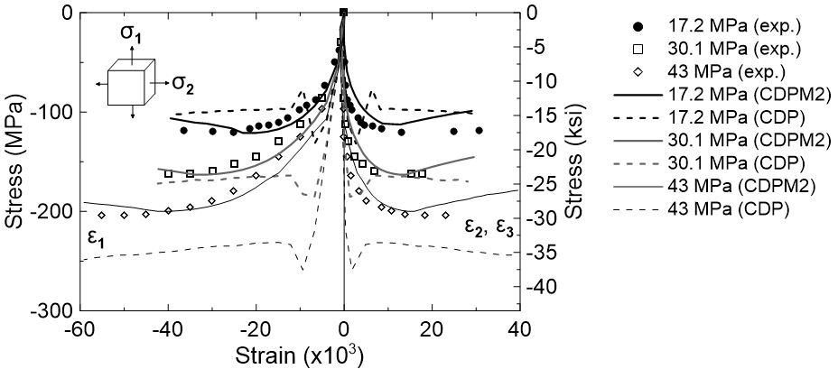

# ABAQUS-version-CDPM2
This repository contains the **ABAQUS user-material (*VUMAT*)** of the concrete damage-plasticity model 2 (**CDPM2**). The CDPM2 was originally developed by the research group of [***Dr. Peter Grassl***](https://petergrassl.com/) at University of Glasgow and has been implemented in LS-DYNA as **MAT CDPM** (**MAT 273**). Afterwards, it was revised for use in ABAQUS by ***Seungwook Seok***, a PhD student at Purdue University.

 

## Background: CDPM2 Vs. CDP Model

The concrete damaged-plasticity (**CDP**) model available in ABAQUS is one of the most commonly used concrete material models readily found in the literature. However, the CDP model was designed only for applications in which concrete is subjected to monotonic, cyclic, and/or dynamic load **under low confining pressures** [[Simulia, 2013]](http://dsk.ippt.pan.pl/docs/abaqus/v6.13/books/usb/default.htm?startat=pt05ch23s06abm39.html). On the other hand, the **CDPM2** has shown its capability to model the material response under various range of confining pressures [[Grassl et al., 2013]](https://www.sciencedirect.com/science/article/pii/S0020768313002886?via%3Dihub). In Figure 1, The performance of these two concrete models (CDPM2 and CDP model) for the modeling of the plain concrete under triaxial compression states with different lateral confining pressure levels is presented and compared with the corresponding experimental results  [[Imran and Pantazopoulou, 1996]](https://www.concrete.org/publications/internationalconcreteabstractsportal/m/details/id/9865). The numerical models consisted of a single cubic finite element (FE) with the characteristic length of 100 mm, subjected to a constant lateral confining pressure in 2- and 3-directions and axially compressed in 1-direction until enough ductile hardening curve was obtained. The analyses were repeated for three different confining pressure levels: 17.2 MPa, 30.1 MPa, and 43 MPa. It is found that the results with the CDPM2 agree quite with the test data, whereas significant deviation was observed for the CDP model. Such deviation gets prominent with higher pressure levels. 

***Figure 1.*** *Stress-Strain responses of concrete material models (CDPM2 and CDP model) for triaxial compression states with different constant lateral confining pressures (17.2 MPa, 30.1 MPa, and 43 MPa), compared with the test data [[Imran and Pantazopoulou, 1996]](https://www.concrete.org/publications/internationalconcreteabstractsportal/m/details/id/9865)*

 

Furthermore, the CDPM2 has shown robust nonlinear behavior of concrete material under wide range of experimental results, including the material responses under monotonic loading, cyclic loading, and even high strain rate loading. For details, please visit the [related website](https://petergrassl.com/Research/DamagePlasticity/index.html).

 

## How to Use

**To be updated.**

 

## Examples

**To be updated.**

 

## References

[1] [P. Grassl, D. Xenos, U. Nyström, R. Rempling, K. Gylltoft. "CDPM2: A damage-plasticity approach to modelling the failure of concrete". International Journal of Solids and Structures. Volume 50, Issue 24, pp. 3805-3816, 2013.](https://www.sciencedirect.com/science/article/pii/S0020768313002886?via%3Dihub)

[2] [P. Grassl, U. Nyström, R. Rempling and K. Gylltoft, "A damage-plasticity model for the dynamic failure of concrete", 8th International Conference on Structural Dynamics, Leuven, Belgium, 2011.](https://arxiv.org/abs/1103.1288)

[3] [P. Grassl and M. Jirásek. "Damage-plastic model for concrete failure". International Journal of Solids and Structures. Vol. 43, pp. 7166-7196, 2006.](https://www.sciencedirect.com/science/article/pii/S002076830600240X)

[4] 

*Please email me if you have any troubles using ABAQUS-CDPM2 at <sseok@purdue.edu>*