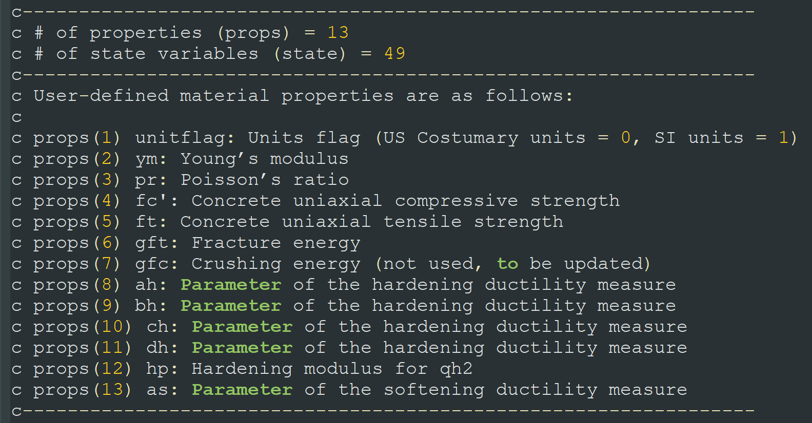
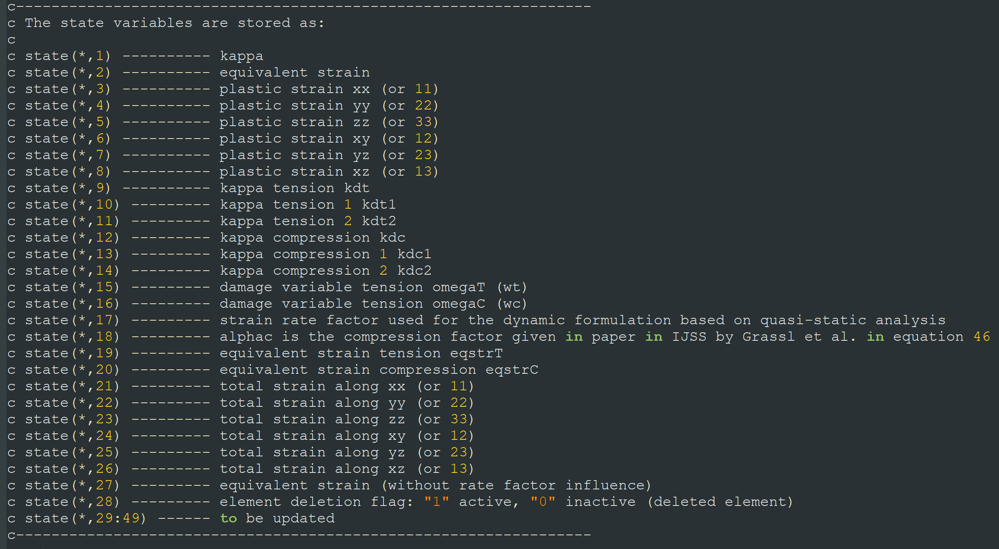
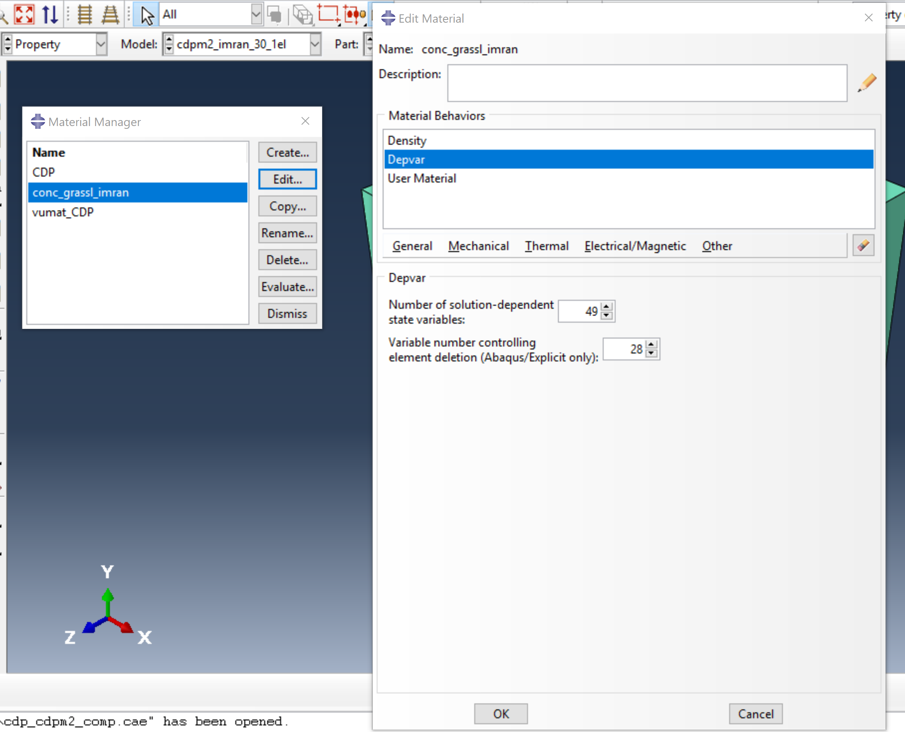
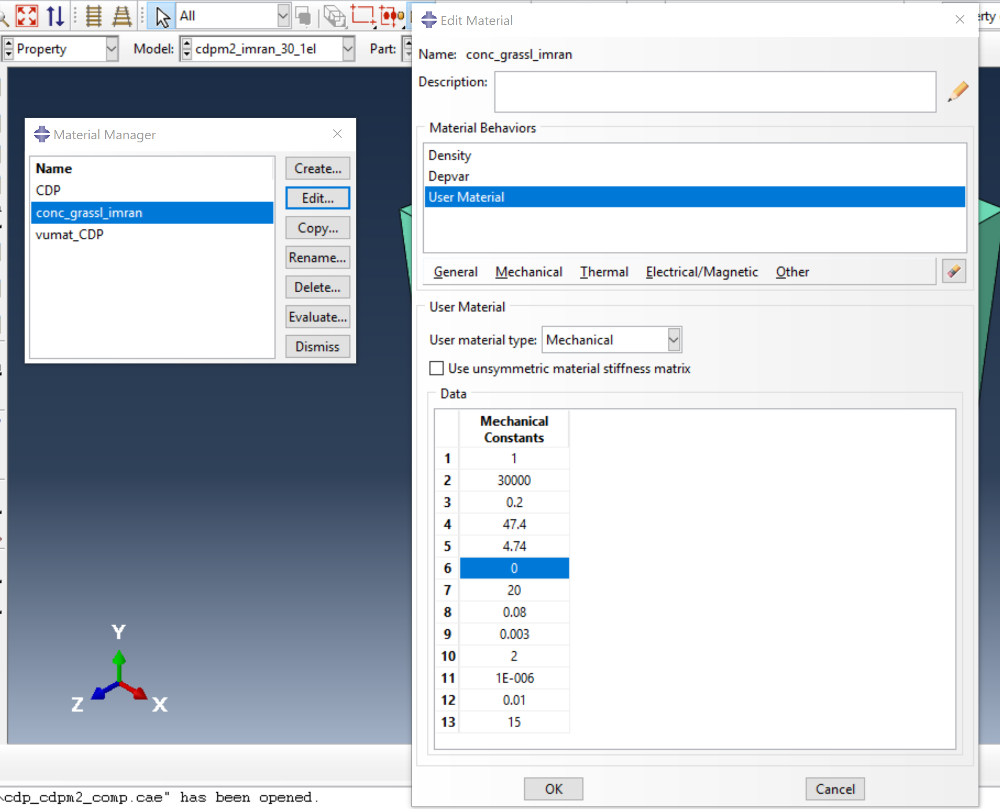
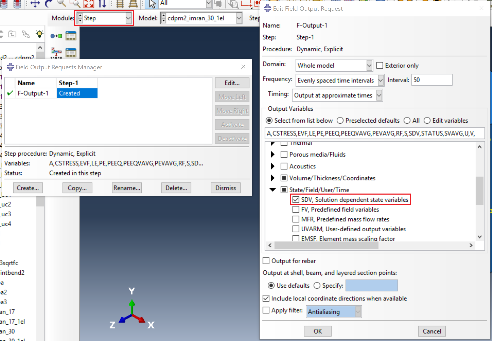

# Abaqus-CDPM2 
This repository contains the **Abaqus user-material (*VUMAT*)** of the concrete damage-plasticity model 2 (**CDPM2**). The CDPM2 was originally developed by the research group of [***Dr. Peter Grassl***](https://petergrassl.com/) at University of Glasgow and has been implemented in LS-DYNA as **MAT_CDPM** (**MAT_273**). Afterwards, it was revised for use in ABAQUS as *VUMAT*, so-called **Abaqus-CDPM2**, by ***Seungwook Seok***, a PhD student at Purdue University.

 

## Background: CDPM2 Vs. CDP Model

The concrete damaged-plasticity (**CDP**) model available in ABAQUS is one of the most commonly used concrete material models readily found in the literature. However, the CDP model was designed only for applications in which concrete is subjected to monotonic, cyclic, and/or dynamic load **under low confining pressures** [[Simulia, 2013]](http://dsk.ippt.pan.pl/docs/abaqus/v6.13/books/usb/default.htm?startat=pt05ch23s06abm39.html). On the other hand, the **CDPM2** has shown its capability to model the material response under various range of confining pressures [[Grassl et al., 2013]](https://www.sciencedirect.com/science/article/pii/S0020768313002886?via%3Dihub). In Figure 1, The performance of these two concrete models (CDPM2 and CDP model) for the modeling of the plain concrete under triaxial compression states with different lateral confining pressure levels is presented and compared with the corresponding experimental results  [[Imran and Pantazopoulou, 1996]](https://www.concrete.org/publications/internationalconcreteabstractsportal/m/details/id/9865). The numerical models consisted of a single cubic finite element (FE) with the characteristic length of 100 mm, subjected to a constant lateral confining pressure in 2- and 3-directions and axially compressed in 1-direction until enough ductile hardening curve was obtained. The analyses were repeated for three different confining pressure levels: 17.2 MPa, 30.1 MPa, and 43 MPa. It is shown that the results with the CDPM2 agree quite with the test data, whereas significant deviation is observed for the CDP model. Such deviation of the CDP model gets prominent with higher pressure levels. 

    

***Figure 1.*** *Stress-strain responses of concrete material models (CDPM2 and CDP model) for triaxial compression states with different constant lateral confining pressures (17.2 MPa, 30.1 MPa, and 43 MPa), compared with the test data [[Imran and Pantazopoulou, 1996]](https://www.concrete.org/publications/internationalconcreteabstractsportal/m/details/id/9865)*

 

Furthermore, the CDPM2 has shown robust nonlinear behavior of concrete material under wide range of experimental results, including the material responses under monotonic loading, cyclic loading, and even high strain rate loading. For more information, please visit the [related website](https://petergrassl.com/Research/DamagePlasticity/index.html).

 

## Material Properties/Parameters and State Variables 

#### Material Properties/Parameters 

The concrete material properties and parameters that have to be properly defined for ABAQUS-CDPM2 ("***cdpm2vumat.f*** " shared in this repository) are listed below:

* (1) unit flag : **0** for US Costumery units or **1** for SI units.

* (2) Young's modulus.

* (3) Poisson's ratio.

* (4) uniaxial compressive strength.

* (5) uniaxial tensile strength.

* (6) ~~fracture energy.~~ 

* (7) crushing energy.

* (8) ~ (11) ah , bh , ch , and dh : parameters for hardening ductility measure and typically defined as **0.08**, **0.003**, **2**, and **1E-6**, respectively.

* (12) hp : hardening modulus for qh2 and typically defined as **0.01**.

* (13) as : parameter for softening ductility measure. This value varies from 1.5 to 15 according to [Grassl et al. (2013)](https://www.sciencedirect.com/science/article/pii/S0020768313002886?via%3Dihub)

  ***Note***

  *The fracture energy (6) is not currently used, but has to be inputted with any value, e.g., "0" (do not  leave in blank!).

  *For the detailed information about the parameters (8) ~ (13), please see [Grassl et al. (2013)](https://www.sciencedirect.com/science/article/pii/S0020768313002886?via%3Dihub)*

    

<i><b>Figure 2.</b> Material Properties and parameters defined for CDPM2 (imamge captured from "cdpm2vumat.f")</i>

 

#### Solution-Dependent State Variables (SDVs)

The solution-dependent state variables (hereafter termed state variables or SDVs) are values that can be defined to evolve with the solution of an analysis [[Simulia, 2013]](http://dsk.ippt.pan.pl/docs/abaqus/v6.13/books/usb/default.htm?startat=pt05ch23s06abm39.html). The SDVs can be used to store (both current and old) data for each material point and can also be used for updating next field/state variables. The *cdpm2vumat* consists of a total of **49 SDVs** with 21 SDVs related to the Jacobian matrix for return mapping (to be updated).  The details about these SDVs are given below in Figure 3.

    

<i><b>Figure 3.</b> state variables (SDVs) defined for CDPM2 (imamge captured from "cdpm2vumat.f")</i>

 

## How to Input Properties/Parameters for CDPM2

To link the VUMAT of CDPM2 (***cdpm2vumat.f***) with ABAQUS, the values for the parameters discussed above have to be inputted by creating a material (here, named conc_grassl_imran) in Abaqus/CAE. This material must be defined with ***Depvar*** and ***User Material***. The ***Density***, associated with gravitational force, is optional. 

* ***Depvar***

  - *Number of solution-dependent state variables*

    : **49** SDVs (as explained in the previous section)

  - *Variable number controlling element deletion*

    : **28** (this indicates that the 28th state plays a role in determining element deletion when that function is ON, but the currently shared cdpm2vumat does not consider element deletion function)

    

<i><b>Figure 4.</b> "Depvar" defined for cdpm2vumat.f </i>

 

- ***User Material***

  ​	: all the material properties and parameters must be provided in the *User Material* in the same order presented in the previous section.

    

<i><b>Figure 5.</b> "User Material" defined for cdpm2vumat.f </i>

 

## Running ABAQUS with CDPM2

This section introduces two ways to run ABQUS input file with *VUMAT* of CDPM2 (*cdpm2vumat.f*): one (1) on Abaqus/CAE or the other (2) on server.

#### On Abaqus/CAE

The step-by-step procedure for running ABAQUS with CDPM2 on Abaqus/CAE is as follows:

1. open CAE file

2. Go to *Step* module.

   Field output request.

   Check ***SDV, solution dependent state variables*** under State/Field/User/Time.

   

       
   

3. Go to *Job* module and do *Edit Job*.

   Under *General*, **locate the folder that contains** ***cdpm2vumat.f***.

   

       
   

4. Submit the job.

   

 

#### On Server

**Prerequisite**: Abaqus input file (***.inp) and *cdpm2vumat.f* must be located in the same folder.

The step-by-step procedure for running ABAQUS with CDPM2 on a server platform is as follows:

1. open any *ssh* (Secure Shell) client and access the server

   

       
   

2. move to the folder where the input file and *cdpm2vumat.f* are located.

3. run your job by typing the following command:

   ​	***abaqus  job=input_file_name  user=cdpm2vumat.f  double=both***

   

       
   

   (here, "opt/abaqus/6.14.6/ecn/bin/" was aforetyped to specify the folder that contains Abaqus command file)

4. open the created *odb* file via Abaqus/CAE once the run is done.

 

## Examples

(***To be updated.***)

 

## References

[1] [P. Grassl, D. Xenos, U. Nyström, R. Rempling, K. Gylltoft. "CDPM2: A damage-plasticity approach to modelling the failure of concrete". International Journal of Solids and Structures. Volume 50, Issue 24, pp. 3805-3816, 2013.](https://www.sciencedirect.com/science/article/pii/S0020768313002886?via%3Dihub)

[2] [P. Grassl, U. Nyström, R. Rempling and K. Gylltoft, "A damage-plasticity model for the dynamic failure of concrete", 8th International Conference on Structural Dynamics, Leuven, Belgium, 2011.](https://arxiv.org/abs/1103.1288)

[3] [P. Grassl and M. Jirásek. "Damage-plastic model for concrete failure". International Journal of Solids and Structures. Vol. 43, pp. 7166-7196, 2006.](https://www.sciencedirect.com/science/article/pii/S002076830600240X)

 

***When citing, please use*** 

*Please email me at <sseok@purdue.edu> if you have any troubles using ABAQUS-CDPM2*

*(Last Updated on: September 5, 2019 )*